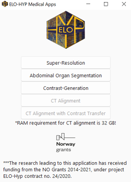

### Medical-Image Application

This repo contains the hyperspectral-image GUI.

The application contains:
- Hyperspectral image Dimensionlity reduction (DR).
  - Principal Component Analysis (PCA)
  - Independent Analysis Component (ICA)
  - Nonnegative Matrix Factorization (NMF)
  - Orthogonal Subspace Projection (OSP)
  - Locality Preserving Projection (LPP)
  
- Hyperspectral image Classification.
  -Sparse Support Vector Machine (SSVM)

## Steps to run the code:

Step 1: Download the resourses and the test samples from [here](https://ctipub-my.sharepoint.com/:f:/g/personal/nitesh_nitesh_stud_acs_upb_ro/Eqc2-temth9Mk_swRpy2exgBjjQssw6SxX_BKihaYF5fow?e=SjvAQJ).

The post_process_data folder contains the pretrained classifiers.

Step 2: Run the code

    python app.py

Requirements to run the application:

- pytorch
- onnxruntime
- PIL
- pydicom
- matplotlib
- opencv

## Steps to use the application as exe:

Step 1: 
   Run the desired DR method (throught the buttons available on the interface) for any data, save the reduced data into user choice folder to use it later for the classification.
   
Step 2:
   Follow the right buttons to check the classification result of the chosen data.
   
Note: One can train the clssifier (if the chosen data is different than what we provided in data folder) by using the code available in jupyter notebook file "training_sample.ipynb".
    
 
  .

